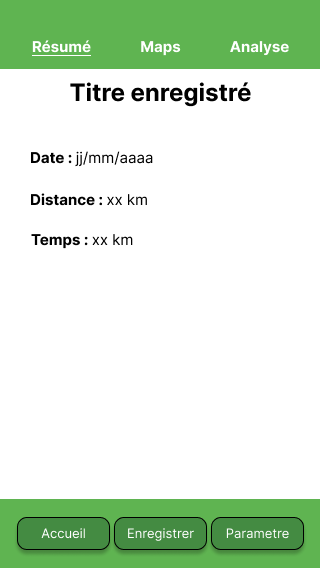
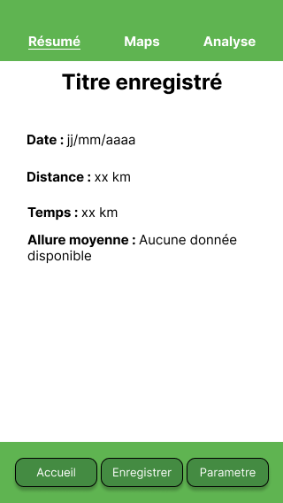

# Sommaire <!-- omit in toc -->

- [1. Ajout de nouvelles données dans la base](#1-ajout-de-nouvelles-données-dans-la-base)
  - [1.1. Données de l'utilisateur](#11-données-de-lutilisateur)
  - [1.2. Affichage pour l'utilisateur](#12-affichage-pour-lutilisateur)
- [2. Côté code](#2-côté-code)
  - [2.1. Côté DAO](#21-côté-dao)
  - [2.2. Côté modèles](#22-côté-modèles)
  - [2.3. Côté vues](#23-côté-vues)
- [3. Ajout de In-app updates](#3-ajout-de-in-app-updates)


# 1. Ajout de nouvelles données dans la base
## 1.1. Données de l'utilisateur
Grâce à notre utilisation de Firebase Firestore, les anciens utilisateurs n'auront aucunes pertes de données concernant leurs précédentes entreés. Quand aux nouvelles, elles seront conformes au modèle de données mis à jour.
## 1.2. Affichage pour l'utilisateur
L'affichage de l'utilisateur sera modifié en fonction des données disponibles dans ses entrées. Si par exemple un trajet d'utilisateur gagne un nouveau champ et que nos modifions les vues de l'application, un message annonçant `Aucune donnée disponible` sera affiché.

Exemple :

**Avant update**</br>


**Après update**</br>


# 2. Côté code
## 2.1. Côté DAO
Du côté des DAOs existants, il n'y aura presque rien à modifier sauf si nous rajoutons des features supplémentaires dans l'application. Grâce à Firestore, nous n'avons pas à modifier comment nous recevons les données, seulement comment nous les traitons.
## 2.2. Côté modèles
Les modèles vont devoirs être mis à jour en fonctions des nouveaux champs ajoutés. Pour faciliter la tâche du côté DAO nous pourrions juste ajouter un nouveau constructeur avec le nouveau champ et le getter/setter correspondant.
## 2.3. Côté vues
Des tests conditionnels devront être effectués pour chaque champs, afin de voir si il est `null` ou non et ainsi modifier l'affichage comme présenté plus haut.
Exemple :
```java
if(trajet.getAllureMoyenne() == null){
    labelAllureMoyenne.setText("Aucune donnée disponible");
}else{
    labelAllureMoyenne.setText(String.valueOf(trajet.getAllureMoyenne()));
}
```

# 3. Ajout de In-app updates
Pour l'ajout des In-app updates, nous pourrions ajouter une classe permettant de vérifier la disponibilité des mises à jour. Cette classe serait appelée et lancerai une vérification du code avant même la phase d'authentification de l'utilisateur.</br>
En cas d'une nouvelle mise à jour, un pop-up permettant de mettre à jour l'application apparaîtra (probablement un pop-up natif d'android).