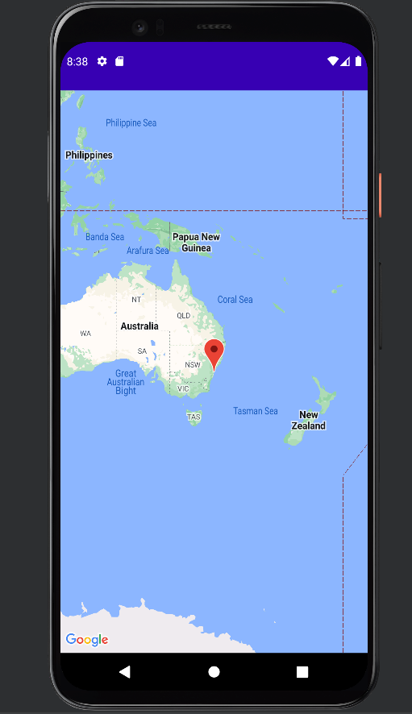

# Utilisation de Google Maps

L'implémentation de google maps étant simple, elle existe déjà dans le projet.

## Création de la map google :

Dans Android studio : click droit -> New -> Fragment -> Google Maps Fragment.

Allez dans `AndroidManifest.xml` et du code s'est rajouté. Suivez les nouvelles instructions.

Une fois la clé API Google Maps acquise et mise dans `local.properties`, voici le résultat sur l'appareil mobile :

